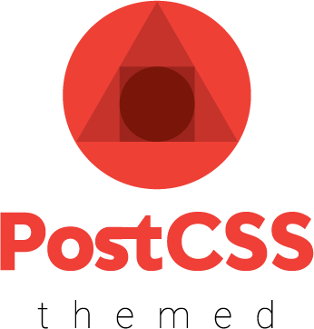

<div align="center">
  
  <p>
  </br>
    PostCSS plugin for adding multiple themes to CSS files.
  </p>
  <div>
    <a href="https://circleci.com/gh/intuit/postcss-themed"></a>
    <a href="https://www.npmjs.com/package/postcss-themed"></a>
    <a href="https://github.com/prettier/prettier"></a>
  </div>
</div>

<br />

Will create class overrides for legacy browsers and use CSS variables for modern browsers.

:rocket: Supports `light` and `dark` color schemes

:rocket: Create component level themes

:rocket: Supports scoping CSS Variable names to mitigate conflicts

[postcss]: https://github.com/postcss/postcss

## Contributing

We appreciate any and all pull requests!

### Setup

First install the dependencies.

```sh
yarn
```

Then write a test for your changes and run the test command! That's it!.

```sh
yarn test
```

## Usage

```js
const config = {
  default: {
    color: 'white'
  },
  other: {
    color: 'black'
  }
};
```

or for per theme `light` and `dark` modes:

```js
const config = {
  default: {
    light: {
      color: 'white'
    },
    dark: {
      color: 'black'
    }
  },
  // Can still just have one level which defaults to light
  other: {
    color: 'purple'
  },
  more: {
    light: {
      color: 'red'
    },
    dark: {
      color: 'blue'
    }
  }
};
```

```js
postcss([require('postcss-themed')({ config })]);
```

See [PostCSS] docs for examples for your environment.

### Using Theme Variables

**Input**

```css
.foo {
  color: @theme color;
  border: @theme border-width solid @theme color;
}
```

**Output**

```css
.foo {
  color: white;
  border: 1px solid white;
}
.other .foo {
  color: black;
  border: 10px solid black;
}
```

### Component themes

Define a component level theme in either commonjs or typescript. A file names `themes.(js|ts)` must be co-located with the themeable CSS file.

**themes.js**

```js
module.exports = (theme) => ({
  default: {
    border: `1px solid ${theme.default.color}`
  }
  other: {
    border: `1px solid ${theme.other.color}`
  }
});
```

**themes.ts**

```js
import { Theme } from '@your/themes';

const CardTheme = (theme: Theme): Theme => ({
  default: {
    border: '1px solid red'
  },
  other: {
    border: `1px solid ${theme.other.color}`
  }
});

export default CardTheme;
```

or provide a function to locate the theme function

### Theme Resolution

By default this plugin will looks for a sibling `theme.js` or `theme.ts`. You can
customize the lookup behavior by supplying your own theme resolution function.

```js
postcss([
  require('postcss-themed')({
    config,
    resolveTheme: cssFileName => {
      // return a function like the ones above
    }
  })
]);
```

Now you can use `@theme border` in your CSS file.

### Theming Root class

Only needed when targeting legacy environments that do not support CSS Variables.

**Input**

```css
:theme-root(.foo) {
  border: 1px solid @theme color;
}
```

or by nesting

**Input**

```css
:theme-root {
  &.foo {
    border: 1px solid @theme color;
  }
}
```

**Output**

```css
.foo {
  border: 1px solid white;
}
.foo.other {
  border: 1px solid black;
}
```

## Options

### modules

This plugin also support scoping your CSS Variable names in a very similar way to CSS Modules. This option should be used when targeting browsers with css variables to avoid name collisions.

You can use any of the tokens listed [here](https://github.com/webpack/loader-utils#interpolatename) to create a scoped name.
The token `[local]` is also available which is the name of the original theme variable.

```js
postcss([
  require('postcss-themed')({
    config,
    modules: '[folder]-[name]-[local]'
  })
]);
```

Another option is to use the default function for scoping variable names.

To use the default function:

```js
postcss([
  require('postcss-themed')({
    config,
    modules: 'default'
  })
]);
```

The default function combines the filepath, name and hashed css into a single string and uses it as a variable name.

```js
const defaultLocalizeFunction = (
  name: string,
  filePath: string,
  css: string
) => {
  const hash = crypto
    .createHash('md5')
    .update(css)
    .digest('hex')
    .slice(0, 6);
  return `${filePath || 'default'}-${name}-${hash}`;
};
```

You can also supply your own function for scoping variable names, again following the API from CSS Modules. If PostCSS does not have a path for the file both the path and css will return an empty string.

```js
postcss([
  require('postcss-themed')({
    config,
    modules: (name: string, filePath: string, css: string) => {
      const hash = crypto
        .createHash('sha1')
        .update(css)
        .digest('hex')
        .slice(0, 3);
      return `${filePath}-${name}-${hash}`;
    }
  })
]);
```

### defaultTheme

An optional parameter to change the name of the _default_ theme (where no extra classes are added to the selector). It defaults to `default`, and also corresponds to the only required key in your `theme.ts` files.

### forceEmptyThemeSelectors - only legacy

By default this plugin will not produce class names for theme that have no component level configuration if there are no styles. (ex: you have 3 themes but your component only uses 1, then only 1 extra set of classnames is produced).

You can use the `forceEmptyThemeSelectors` to force these empty classes to be added. If you use this option you should also use some form of css minification that can get rid of the empty classes. If you don't your CSS will be bloated.

This feature is useful if your are converting your css-modules to typescript and need the generated typescript file to include all of the possible themes.

```js
postcss([
  require('postcss-themed')({ config, forceEmptyThemeSelectors: true })
]);
```

### forceSingleTheme

This is a niche option which only inserts a single theme.
At first glance, this may seem strange because this plugin primarily allows you to support _many_ themes in a _single_ CSS file.
This option helps if you want to generate _many_ CSS files, each with their own theme. You'll run PostCSS multiple times, switching the single theme.
In practice, we use this to generate extra CSS files for teams that only need a single theme. The main CSS file still has all of them, but teams can optionally use the one that only has the theme they need.

It is still recommended to set defaultTheme with this option, as any missing variables will be merged with the default.

### Usage

```js
const config = {
  default: {
    light: {
      color: 'purple'
    },
    dark: {
      color: 'black'
    }
  },
  chair: {
    light: {
      color: 'beige'
    },
    dark: {
      color: 'dark-purple'
    }
  }
};

postcss([
  require('postcss-themed')({
    config,
    defaultTheme: 'default',
    forceSingleTheme: 'chair'
  })
]);
```

**Input**

```css
.test {
  color: @theme color;
}
```

**Output**

```css
.test {
  color: var(--color);
}

:root {
  --color: beige;
}

.dark {
  --color: dark-purple;
}
```

As you can see in the above example, only one theme will be generated using this option.

### optimizeSingleTheme

This option should only be used in conjunction with `forceSingleTheme`.
By default `forceSingleTheme` will always add CSS variables, since many users still want to be able to modify and override them.
However, if you are not going to be modifying them, we can optimize the single theme further by removing variables when possible.
If only a light theme is specified, this config option will just do in-place replacement of the theme variables.

### Usage

```js
const config = {
  default: {
    color: 'purple'
  },
  chair: {
    color: 'beige'
  }
};

postcss([
  require('postcss-themed')({
    config,
    defaultTheme: 'default',
    forceSingleTheme: 'chair',
    optimizeSingleTheme: true
  })
]);
```

**Input**

```css
.test {
  color: @theme color;
}
```

**Output**

```css
.test {
  color: beige;
}
```

## Debug

This package uses the npm package [debug](https://www.npmjs.com/package/debug) to log errors while it's running.

Simply set the `DEBUG` environment variable to `postcss-themed`.

```sh
DEBUG=postcss-themed postcss input.css -o output.css
```

## Contributors ✨

Thanks goes to these wonderful people ([emoji key](https://allcontributors.org/docs/en/emoji-key)):

<!-- ALL-CONTRIBUTORS-LIST:START - Do not remove or modify this section -->
<!-- prettier-ignore-start -->
<!-- markdownlint-disable -->
<table>
  <tr>
    <td align="center"><a href="http://tylerkrupicka.com"><br /><sub><b>Tyler Krupicka</b></sub></a><br /><a href="https://github.com/intuit/postcss-themed/commits?author=tylerkrupicka" title="Code">💻</a> <a href="https://github.com/intuit/postcss-themed/commits?author=tylerkrupicka" title="Tests">⚠️</a> <a href="https://github.com/intuit/postcss-themed/commits?author=tylerkrupicka" title="Documentation">📖</a></td>
    <td align="center"><a href="http://hipstersmoothie.com"><br /><sub><b>Andrew Lisowski</b></sub></a><br /><a href="https://github.com/intuit/postcss-themed/commits?author=hipstersmoothie" title="Code">💻</a> <a href="https://github.com/intuit/postcss-themed/commits?author=hipstersmoothie" title="Tests">⚠️</a> <a href="https://github.com/intuit/postcss-themed/commits?author=hipstersmoothie" title="Documentation">📖</a></td>
    <td align="center"><a href="https://adamdierkens.com"><br /><sub><b>Adam Dierkens</b></sub></a><br /><a href="https://github.com/intuit/postcss-themed/commits?author=adierkens" title="Code">💻</a></td>
    <td align="center"><a href="https://christyjacob4.github.io"><br /><sub><b>Christy Jacob</b></sub></a><br /><a href="https://github.com/intuit/postcss-themed/commits?author=christyjacob4" title="Code">💻</a> <a href="https://github.com/intuit/postcss-themed/commits?author=christyjacob4" title="Documentation">📖</a></td>
    <td align="center"><a href="https://github.com/Sharps"><br /><sub><b>Sharps</b></sub></a><br /><a href="#design-Sharps" title="Design">🎨</a></td>
    <td align="center"><a href="https://www.behance.net/amandayoshiizumi"><br /><sub><b>Amanda Yoshiizumi</b></sub></a><br /><a href="#design-mandyellow" title="Design">🎨</a></td>
    <td align="center"><a href="https://github.com/ratnamal"><br /><sub><b>Ratnamala Korlepara</b></sub></a><br /><a href="https://github.com/intuit/postcss-themed/commits?author=ratnamal" title="Tests">⚠️</a> <a href="https://github.com/intuit/postcss-themed/commits?author=ratnamal" title="Documentation">📖</a></td>
  </tr>
  <tr>
    <td align="center"><a href="http://enzozafra.com/"><br /><sub><b>Enzo Zafra</b></sub></a><br /><a href="https://github.com/intuit/postcss-themed/commits?author=EnzoZafra" title="Code">💻</a> <a href="https://github.com/intuit/postcss-themed/commits?author=EnzoZafra" title="Documentation">📖</a> <a href="#infra-EnzoZafra" title="Infrastructure (Hosting, Build-Tools, etc)">🚇</a> <a href="https://github.com/intuit/postcss-themed/commits?author=EnzoZafra" title="Tests">⚠️</a></td>
  </tr>
</table>

<!-- markdownlint-enable -->
<!-- prettier-ignore-end -->
<!-- ALL-CONTRIBUTORS-LIST:END -->

This project follows the [all-contributors](https://github.com/all-contributors/all-contributors) specification. Contributions of any kind welcome!
